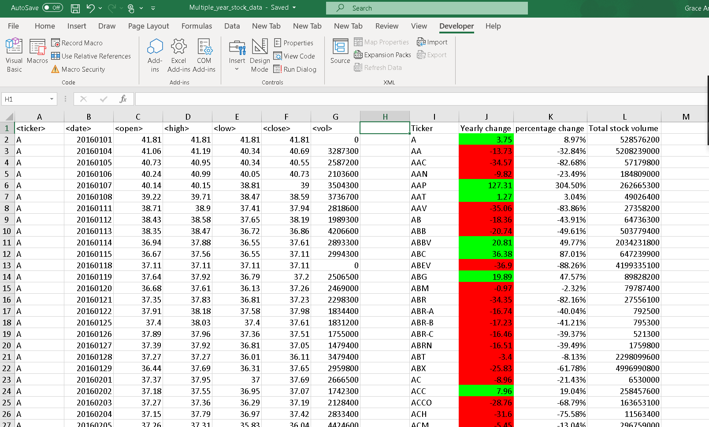

# VBA-challenge
* VBA scripting to analyze real stock market data.
* The script loops through all the stocks for one year and outputs the following information.

  * The ticker symbol.

  * Yearly change from opening price at the beginning of a given year to the closing price at the end of that year.

  * The percent change from opening price at the beginning of a given year to the closing price at the end of that year.

  * The total stock volume of the stock.
  * Conditional formatting on yearly change highlights positive change in green and negative change in red.
  